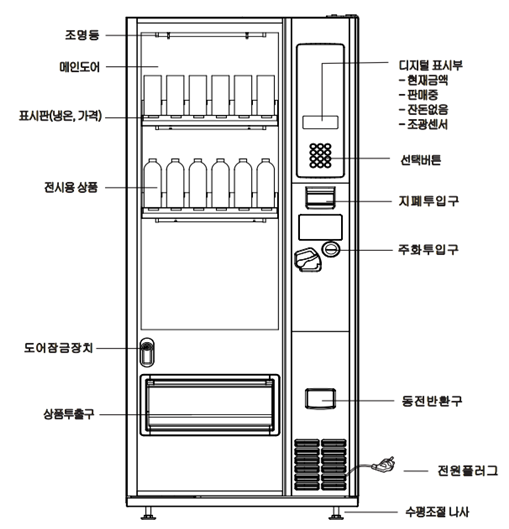
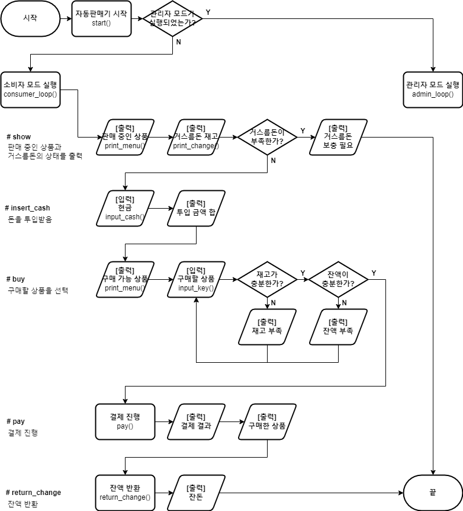
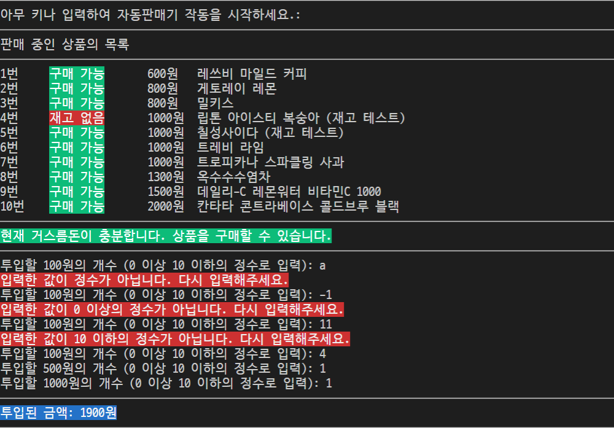
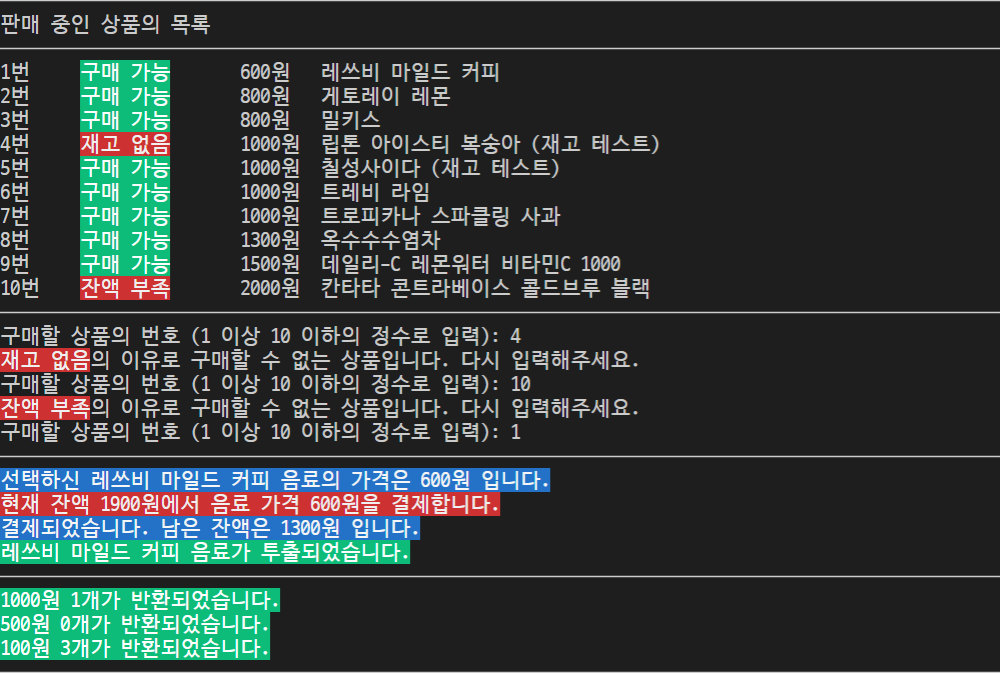
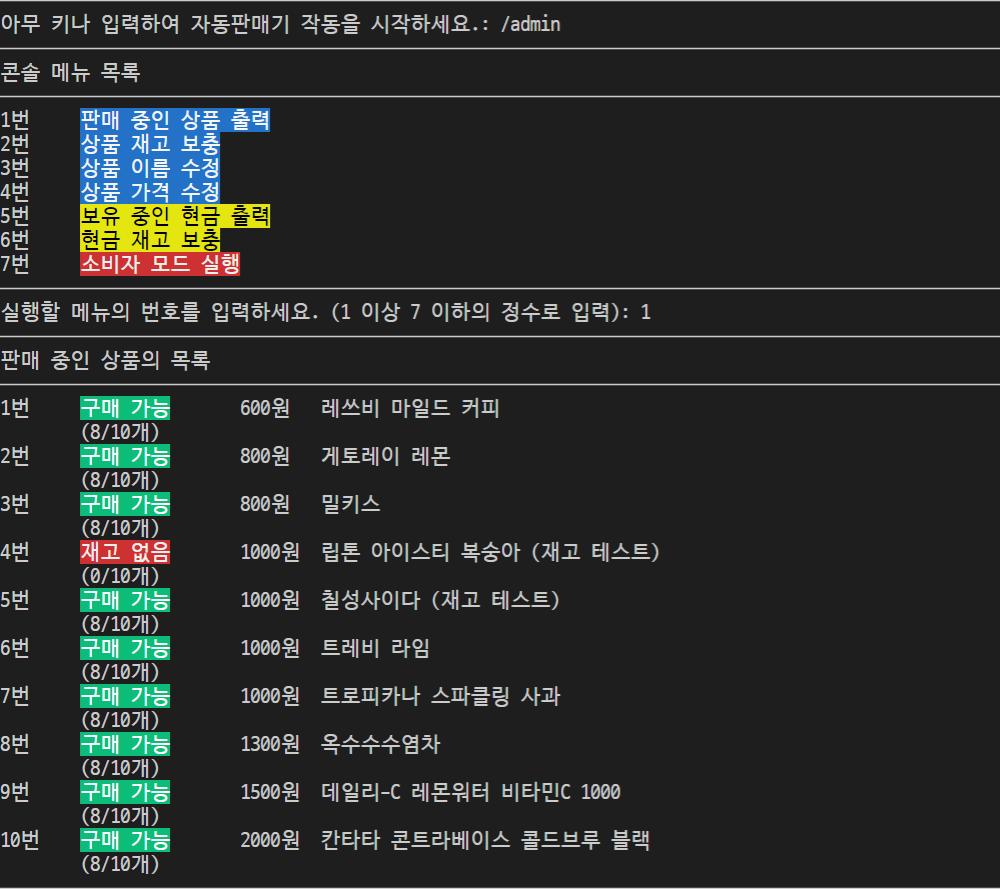
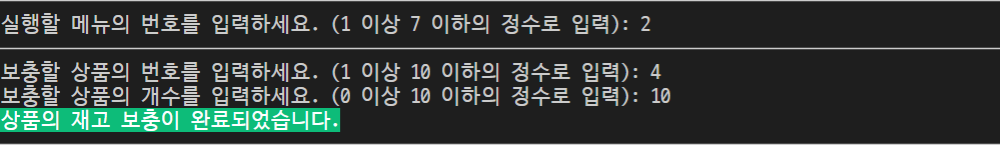
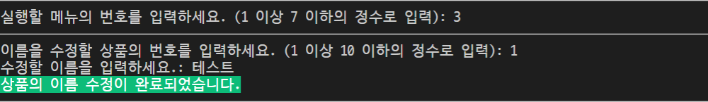
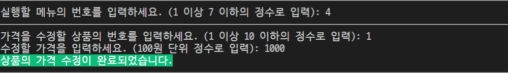
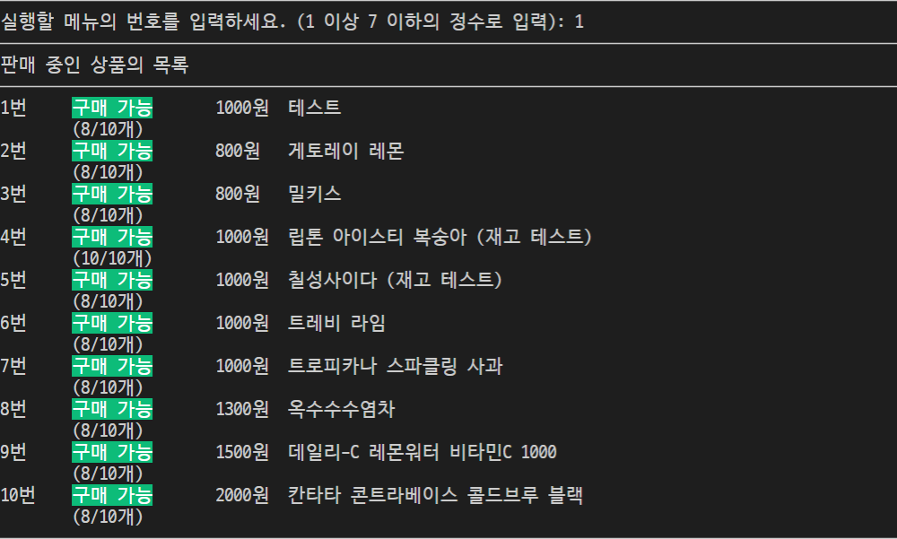
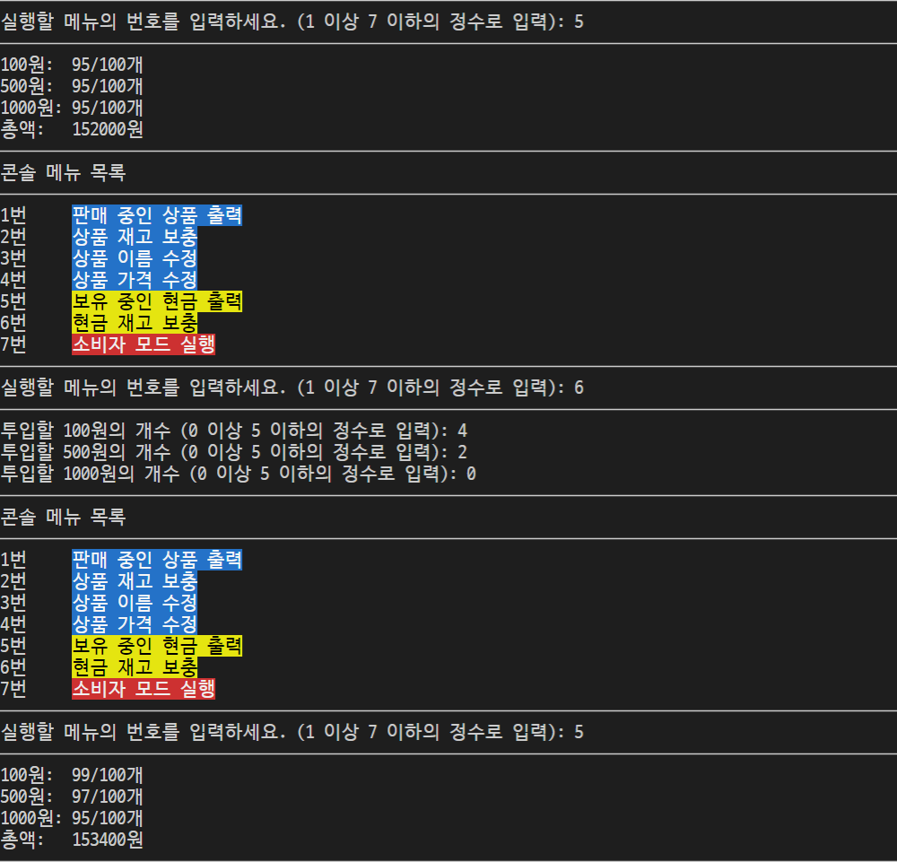

# 자판기 프로젝트: 절차지향에서 객체지향으로

> Python으로 구현한 자동판매기 시뮬레이터를 통해 절차지향과 객체지향 프로그래밍의 차이를 비교한다.

## 목차
1. [프로젝트 개요](#1-프로젝트-개요)
2. [요구사항 분석](#2-요구사항-분석)
3. [절차지향 vs 객체지향: 개념적 비교](#3-절차지향-vs-객체지향-개념적-비교)
4. [구현 비교](#4-구현-비교)
5. [실행 및 테스트](#5-실행-및-테스트)
6. [결론](#6-결론)

---

## 1. 프로젝트 개요

### 배경
- 1학년 1학기 전산학기초 개인 과제
- Python 객체지향 자동판매기 개발

### 개발 환경
- Python 3.x
- Miniconda Virtual Environment
- Visual Studio Code

### 프로젝트 구조
```
vending-machine/
├── procedural/          # 절차지향 버전
│   ├── main.py
│   ├── basic_module.py
│   ├── consumer_module.py
│   └── admin_module.py
├── object-oriented/     # 객체지향 버전
│   ├── main.py
│   ├── basic.py
│   ├── drink.py
│   ├── cash.py
│   └── vending_machine.py
└── assets/              # 이미지 자료
```

---

## 2. 요구사항 분석

### 2.1 자판기 구조

<p align="center">
  
</p>

실제 자판기의 구조이다. (출처: ㈜로벤, RCP-2012DB 모델)

<p align="center">
  
</p>

자판기의 대략적인 동작 흐름이다.

### 2.2 음료 데이터

| 제품명 | 가격 |
|:---:|:---:|
| 레쓰비 마일드 커피 | 600원 |
| 게토레이 레몬 | 800원 |
| 밀키스 | 800원 |
| 립톤 아이스티 복숭아 | 1,000원 |
| 칠성사이다 | 1,000원 |
| 트레비 라임 | 1,000원 |
| 트로피카나 스파클링 사과 | 1,000원 |
| 옥수수수염차 | 1,300원 |
| 데일리-C 레몬워터 비타민C 1000 | 1,500원 |
| 칸타타 콘트라베이스 콜드브루 블랙 | 2,000원 |

### 2.3 기능적 요구사항

#### 사용자 기능
- 음료의 이름, 가격, 재고 상태 및 자판기 상태 출력
- 100원, 500원, 1,000원 화폐 투입 및 금액 계산
- 음료 선택 및 결제 처리
- 고액권 순서로 잔돈 반환

#### 관리자 기능
- 음료 재고 출력/보충
- 음료 이름/가격 수정
- 현금 재고 출력/보충

### 2.4 비기능적 요구사항
- 객체지향 원칙(캡슐화, 상속, 다형성) 준수
- 예외 처리

---

## 3. 절차지향 vs 객체지향: 개념적 비교

### 3.1 패러다임의 본질적 차이

| 구분 | 절차지향 (Procedural) | 객체지향 (Object-Oriented) |
|:---:|:---|:---|
| **핵심 개념** | 순차적인 명령어의 흐름 | 데이터와 행위를 묶은 객체 |
| **설계 관점** | 어떤 순서로 처리할 것인가? | 어떤 객체들이 협력할 것인가? |
| **데이터 관리** | 함수 외부에 데이터 존재 | 객체 내부에 데이터 캡슐화 |
| **코드 재사용** | 함수 호출 | 상속, 합성, 다형성 |

### 3.2 자판기로 보는 관점의 차이

#### 절차지향적 사고
```
1. 음료 데이터를 딕셔너리로 저장한다.
2. 현금 데이터를 딕셔너리로 저장한다.
3. 화면에 음료 목록을 출력하는 함수를 만든다.
4. 돈을 투입받는 함수를 만든다.
5. 결제하는 함수를 만든다.
6. 잔돈을 반환하는 함수를 만든다.
```

#### 객체지향적 사고
```
1. "음료"라는 객체가 있다. (이름, 가격, 재고를 가짐)
2. "현금"이라는 객체가 있다. (액면가, 수량을 가짐)
3. "자판기"라는 객체가 있다. (음료들과 현금을 관리함)
4. 자판기는 음료를 보여주고, 결제하고, 잔돈을 반환할 수 있다.
```

### 3.3 캡슐화의 중요성

**절차지향의 문제점**: 데이터가 외부에 노출되어 어디서든 수정 가능

```python
# procedural - 데이터가 딕셔너리로 노출됨
drink_dic = {
    1: ["콜라", 1000, 10],  # [이름, 가격, 재고]
    2: ["사이다", 1000, 10]
}

# 어디서든 직접 수정 가능 (위험!)
drink_dic[1][2] = -999  # 재고가 음수?
drink_dic[1][1] = "무료"  # 가격이 문자열?
```

**객체지향의 해결책**: 데이터를 숨기고 메서드로만 접근

```python
# object-oriented - 데이터가 캡슐화됨
class Drink:
    def __init__(self, name, price, quantity):
        self.__name = name      # private
        self.__price = price    # private
        self.__quantity = quantity  # private

    def get_price(self):
        return self.__price

    def set_quantity(self, value):
        if value >= 0:  # 유효성 검증 가능
            self.__quantity = value
```

### 3.4 확장성과 유지보수

| 상황 | 절차지향 | 객체지향 |
|:---|:---|:---|
| 새 음료 추가 | 딕셔너리에 항목 추가 | 새 Drink 객체 생성 |
| 할인 기능 추가 | 모든 함수 수정 필요 | Drink 클래스에 메서드 추가 |
| 카드 결제 추가 | Cash 관련 모든 로직 수정 | Payment 클래스 상속/추가 |
| 버그 발생 시 | 전체 흐름 추적 필요 | 해당 객체만 확인 |

---

## 4. 구현 비교

### 4.1 procedural (절차지향)

#### 구성
| 파일 | 기능 |
|:---:|:---|
| `main.py` | 메인 루프 구현 |
| `basic_module.py` | 공통 유틸리티 함수 |
| `consumer_module.py` | 사용자 모드 함수 |
| `admin_module.py` | 관리자 모드 함수 |

#### 코드 특징

**데이터 구조** - 중첩 딕셔너리 사용
```python
# 음료: { key: [name, price, quantity] }
drink_dic = {
    1: ["콜라", 1000, 10],
    2: ["사이다", 1000, 10]
}

# 현금: { face_value: [stock, insert, return] }
change_dic = {
    100: [100, 0, 0],
    500: [100, 0, 0],
    1000: [100, 0, 0],
    0: 0  # balance
}
```

**함수 설계** - 데이터를 인자로 전달
```python
def check_state(d, k, c):  # drink_dic, key, change_dic
    if c[0] == 'dflt':
        if d[k][2] == 0:
            return s0  # 재고 없음
        else:
            return s2  # 구매 가능
    # ...

def pay(d, k, c):  # 모든 함수가 d, k, c를 받음
    p = d[k][1]  # price
    c[0] -= p    # balance 차감
    d[k][2] -= 1 # 재고 감소
```

#### 한계점
- `d[k][2]`와 같은 매직 인덱스로 가독성 저하
- 데이터 구조 변경 시 모든 함수 수정 필요
- 유효성 검증 로직이 분산됨

### 4.2 object-oriented (객체지향)

#### 구성
| 파일 | 기능 |
|:---:|:---|
| `main.py` | 진입점, 로그인 처리 |
| `basic.py` | 공통 유틸리티 함수 |
| `drink.py` | Drink 클래스 |
| `cash.py` | Cash 클래스 |
| `vending_machine.py` | VendingMachine 클래스 |

#### 클래스 설계

**Drink 클래스** - 음료 데이터와 행위를 캡슐화
```python
class Drink:
    def __init__(self, name, price, quantity):
        self.__name = name
        self.__price = price
        self.__quantity = quantity

    def get_name(self):
        return self.__name

    def get_price(self):
        return self.__price

    def is_available(self, cash):
        return self.__quantity > 0 and self.__price <= cash

    def info_drink(self, cash=None, admin=False):
        # 상태에 따른 정보 문자열 반환
```

**Cash 클래스** - 화폐 단위별 관리
```python
class Cash:
    def __init__(self, face_value, quantity):
        self.__face_value = face_value
        self.__quantity = quantity

    def get_face_value(self):
        return self.__face_value

    def amount(self):
        return self.__face_value * self.__quantity
```

**VendingMachine 클래스** - 전체 시스템 관리
```python
class VendingMachine:
    def __init__(self, init_drink, init_cash):
        self.__drink_dic = {key: Drink(*values) for key, values in init_drink.items()}
        self.__change_dic = {key: Cash(*values) for key, values in init_cash.items()}

    def pay(self, key, balance):
        drink = self.__drink_dic[key]
        drink.set_quantity(drink.get_quantity() - 1)
        return balance - drink.get_price()

    def consumer_loop(self):
        # 사용자 모드 메인 루프

    def admin_loop(self):
        # 관리자 모드 메인 루프
```

#### 개선점
- 명확한 메서드명으로 가독성 향상 (`drink.get_price()` vs `d[k][1]`)
- 데이터와 로직이 함께 있어 응집도 높음
- 변경 영향 범위가 클래스 내부로 제한됨

### 4.3 동일 기능의 코드 비교

#### 결제 처리

**절차지향 (procedural)**
```python
def pay(d, k, c):
    p = d[k][1]  # price가 뭔지 알기 어려움
    c[0] -= p    # c[0]이 balance인지 알기 어려움
    d[k][2] -= 1 # d[k][2]가 재고인지 알기 어려움
```

**객체지향 (object-oriented)**
```python
def pay(self, key, balance):
    drink = self.__drink_dic[key]
    drink.set_quantity(drink.get_quantity() - 1)  # 재고 감소
    return balance - drink.get_price()  # 잔액 반환
```

#### 상태 확인

**절차지향 (procedural)**
```python
def check_state(d, k, c):
    if c[0] == 'dflt':
        if d[k][2] == 0:
            return s0
        else:
            return s2
    else:
        if d[k][2] == 0:
            return s0
        elif c[0] < d[k][1]:
            return s1
        else:
            return s2
```

**객체지향 (object-oriented)**
```python
# Drink 클래스 내부
def is_available(self, cash):
    return self.__quantity > 0 and self.__price <= cash
```

---

## 5. 실행 및 테스트

### 5.1 실행 방법

```bash
# 절차지향 버전
cd procedural && python3 main.py

# 객체지향 버전
cd object-oriented && python3 main.py
```

### 5.2 사용자 모드

<p align="center">
  
</p>

- 음료 목록과 재고 상태 표시
- 거스름돈 부족 시 판매 거부
- 현금 투입은 액면가별 개수 단위

<p align="center">
  
</p>

- 투입 금액에 따라 구매 가능 상태 갱신
- 잔액/재고 부족 상품 구매 불가
- 고액권 순서로 잔돈 자동 계산

### 5.3 관리자 모드

`/admin` 입력으로 진입

<p align="center">
  
</p>

- 관리자 전용 메뉴 표시
- 재고 상태 상세 확인 가능

<p align="center">
  
</p>

- 재고 보충 (최대 10개 제한)

<p align="center">
  
</p>
<p align="center">
  
</p>

- 이름/가격 수정 기능

<p align="center">
  
</p>

- 수정 결과 확인

<p align="center">
  
</p>

- 보유 현금 확인 및 보충

---

## 6. 결론

### 6.1 언제 어떤 패러다임을 선택할까?

| 상황 | 권장 패러다임 |
|:---|:---|
| 단순한 스크립트, 일회성 작업 | 절차지향 |
| 데이터 변환 파이프라인 | 절차지향 (+ 함수형) |
| 복잡한 상태 관리 필요 | 객체지향 |
| 확장/유지보수가 예상됨 | 객체지향 |
| 팀 협업 프로젝트 | 객체지향 |

### 6.2 이 프로젝트에서 배운 점

1. **절차지향의 장점**: 간단한 로직은 빠르게 구현 가능
2. **절차지향의 한계**: 규모가 커지면 데이터 흐름 추적이 어려움
3. **객체지향의 장점**: 코드 가독성, 유지보수성, 확장성 향상
4. **객체지향의 고려사항**: 초기 설계에 더 많은 시간 필요

### 6.3 향후 개선 방향

- 추상 클래스/인터페이스 도입 (Payment 추상화 등)
- 상태 패턴 적용 (State Machine)
- 단위 테스트 추가
- GUI/웹 인터페이스 확장

---

## 참고 자료

- 자판기 이미지 출처: ㈜로벤, RCP-2012DB 모델 자동판매기
- Python 공식 문서: [Classes](https://docs.python.org/3/tutorial/classes.html)
